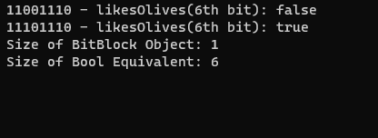

# BitBlocks
 

 BitBlocks is a C++ single header that provides a method to pack up to 8 booleans in a single byte while also allowing you to organize booleans into enums.
 
## Usage
 

Include the header in your project and simply create a new class with your desired enums as the parameter. The demo shows how you can create an enum of unsigned chars to represent the boolean name.

```cpp
BitBlocks menuOptions(menuAnimations | menuScaleability | menuMoveability | menuColor | menuOpen);

// Toggle booleans on and off using the built-in function
menuOptions.ToggleBit(menuOpen);

// Check the value of the boolean using bitwise operators
if (menuOptions(menuOpen) || menuOptions & menuOpen){
    ...
}
```

## Compatibility
Compatible with both x86 and x64 due to the use of generic types. Doesn't require any other headers (i.e Windows.h etc...)

## Performance
By using a single char as opposed to individual booleans, larger projects that require the use of multiple booleans can pack them in a single byte which can reduce both file size
and improve performance via optimized caching. The boolean equivalent of 1 BitBlock (1 Byte) is 8 Booleans (8 Bytes)

## Technical Explanation
Bytes in memory are interpreted by computers as eight 1s or 0s. This allows any individual byte a max value of 256. However a boolean can only take 2 values (1 and 0). 
But because modern CPUs can't address anything smaller than a byte, developers represent a boolean with a full byte. This means that the 7 other bits in any boolean are wasted 
and unused.

Thus, by taking advantage of the base 2 nature of binary, we can assign each bit of a byte to a boolean value. This is also known as bit packing.
The benefit to packing multiple booleans into a single byte is that we can reduce the amount of wasted computer capacity and theoretically reduce the latency
of accessing booleans in memory by referencing a single location in memory for every 8 booleans.

## Resources
- [Bit Packing]([https://learn.microsoft.com/en-us/windows/win32/debug/vectored-exception-handling](https://towardsdatascience.com/smart-way-of-storing-data-d22dd5077340)https://towardsdatascience.com/smart-way-of-storing-data-d22dd5077340)
